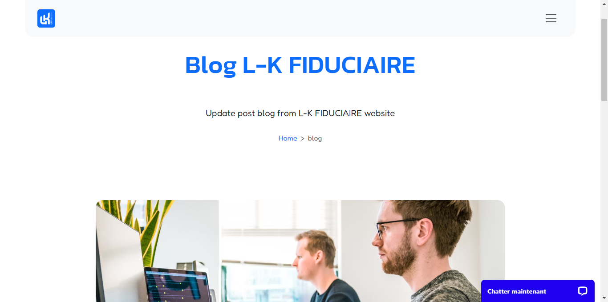

## Blog Setup

To configure your blog list page, you can access on blog menu area, for local lang you can access on blog setup france.

### Blog Config

Update your title description and cover image for your blog list setup

### Blog List Output

The output for blog list setupheaderlist

## Blog Posts

To update delete or create new content article you can access on blog menu, if you want update for your local lang , so you can access on blog france menu.

### New / Update article

Insert title, description, upload image on this area.

Next you can scroll down and write your article.

### Article output

The blog article post output.
