## Conselis Advice Area

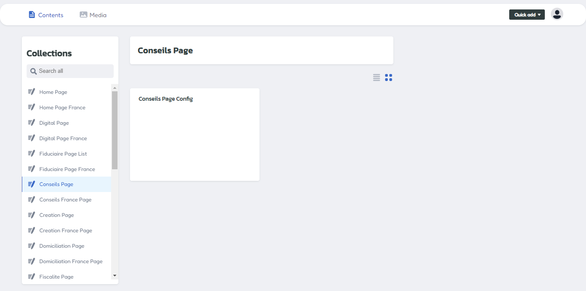

For update your Conselis Advice page,access on conselis menu if you want to update for your main site with english lang, for local lang or france language, you can access on  Conselis france menu.

## Header Area

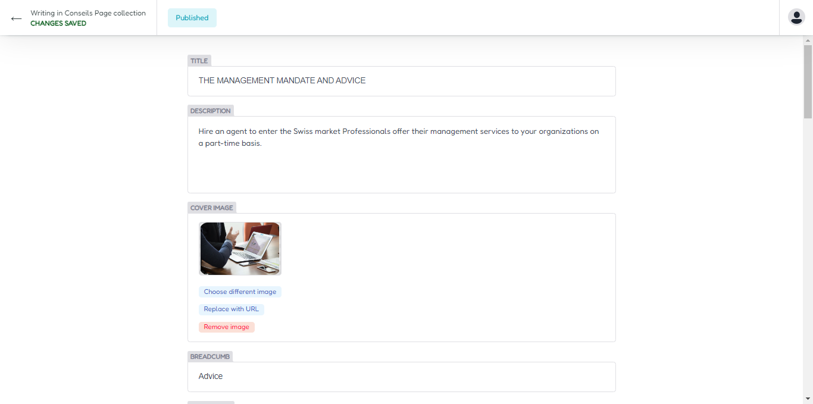

Insert your title and description and upload cover image on this area.

### Header Output

Your header page output.

## Intro Area

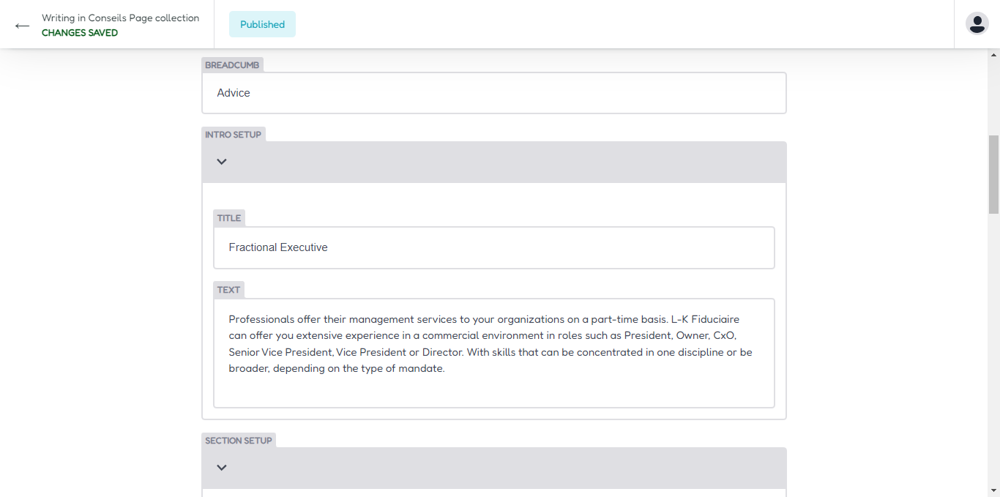

Scroll on intro area, and you can insert intro title and text information here.

### Intro Output

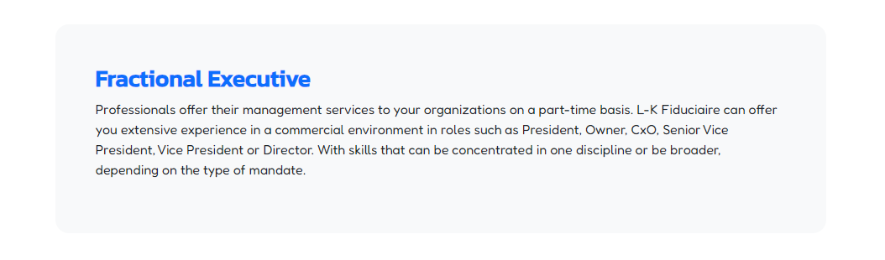

Your intro section output.

## Section Area

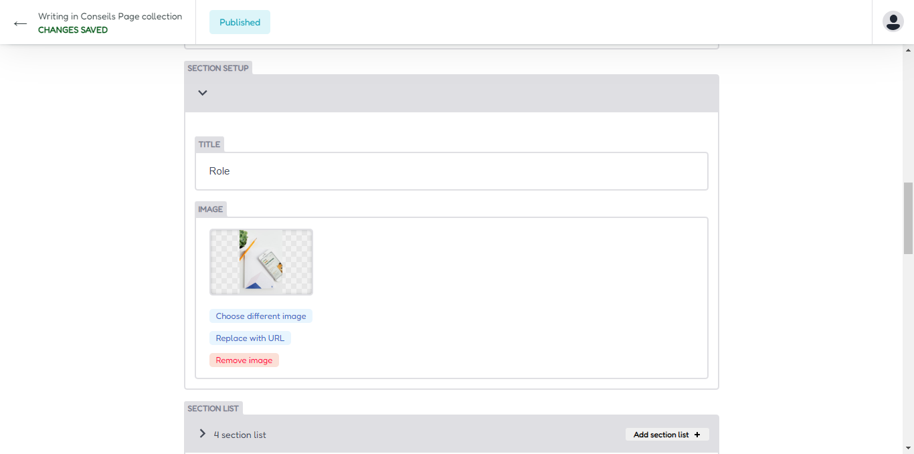

Now you can access on section area, and insert title information and upload image about section area here.

### Section List

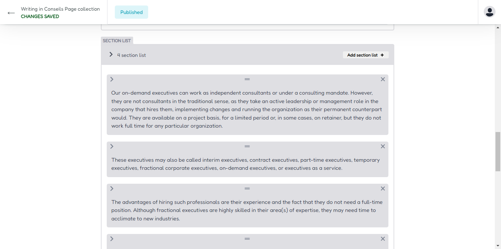

Access on section list, then update your section list, for create new you can click add section list button.

### Section Output

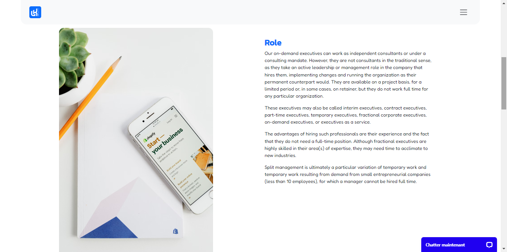

The output display for your section area.

## Article Area

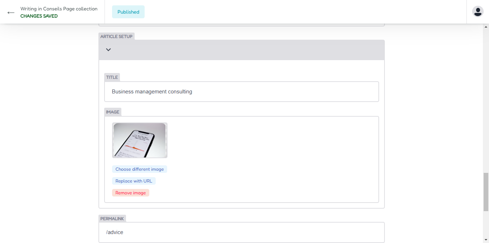

Access on article area , and update your article information on this area. insert title and upload your cover image.

### Content article

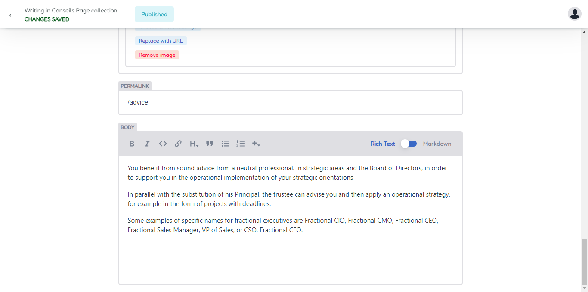

For write content , you can access on content menu, and write your article in here.

### Article Ouput

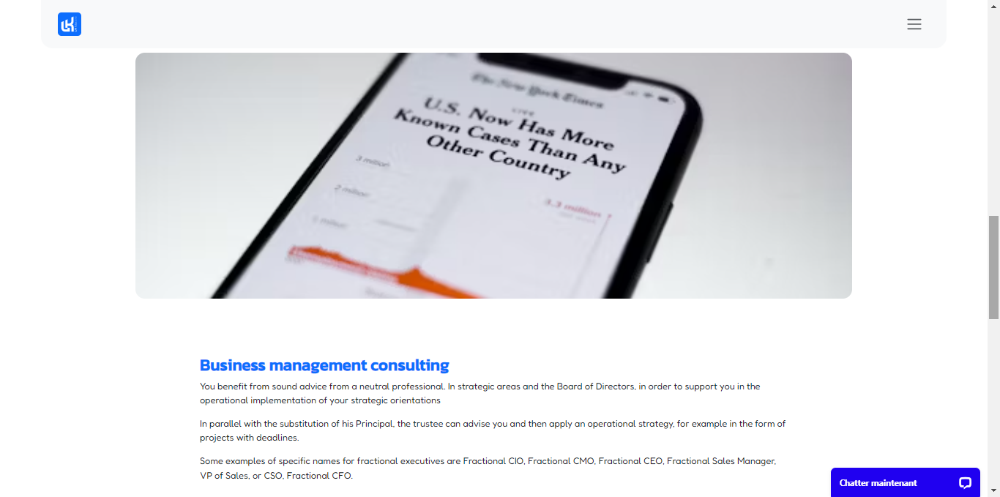

Output for article content area.

## Full Design Output

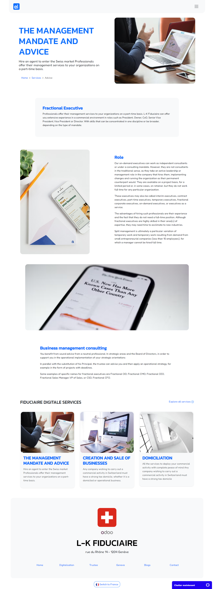

Output for full conselis advice area.