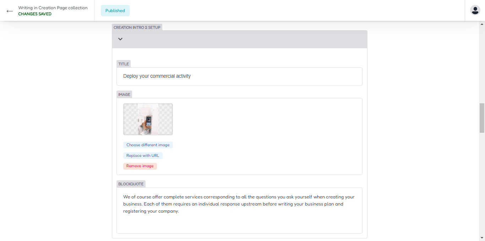

## Creation Area

For update creation page area you can access on creation menu, for france or local language you can access on creation france menu.

## Header Area

Insert your title and description and upload cover image on this area.

### Header Output

Your header creation output look like on image

## Intro 1 Area

Scroll down and access on intro 1 area, then update title , upload cover image, and insert your text information on this area.

### Intro 1 List

Access on intro 1 list open menu and update your information on this area.For add new list, you can click on add new list button.

### Intro 1 Output

Your intro 1 output look like on image

## Intro 2 Area

Scroll down and access on intro 2 area, then update title , upload cover image, and insert your text information on this area.

### Intro 2 List

Access on intro 2 list open menu and update your information on this area.For add new list, you can click on add new list button.

### Intro 2 Output

Your intro 2 output look like on image

## Accroidon Area

For update accrodion area you can access on accroidon and update on this area.

### Accroidon List Area

Next you can access on accroidon list , and you update accoridon list in here, update title, id, text header,text bottom and so on.

## Advantages Area

For update advantages area you can access on advantages and update on this area.

## Output advantages Accoridon

Your accroidon and advantages output.

## Full Creation Design

Full output design for creation page area.
