## Digital Page Area

For update digital page , you can access on backend CMS, then select on digital page, for update digital page local language, you can access on digitalpage france menu.

## Header Area

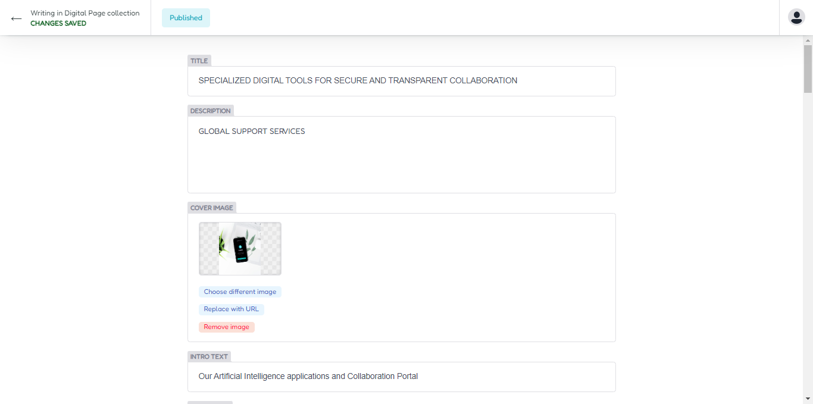

For first you can add your title and description , cover image and intro text for your digital page area.

### Header Output

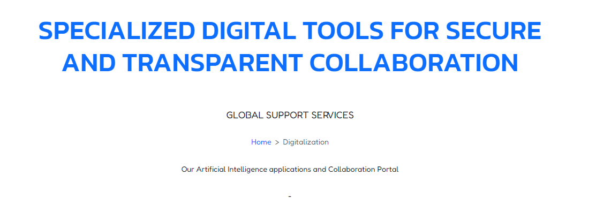

The output for digital page title description.

## Intro List

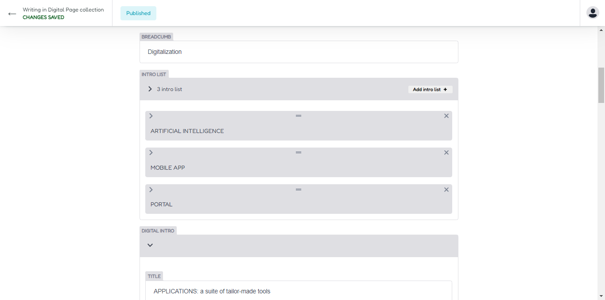

Now you can access on intro list for update your intro list information. click dropdown menu then change title, description and icon with your needs.

### Intro Output

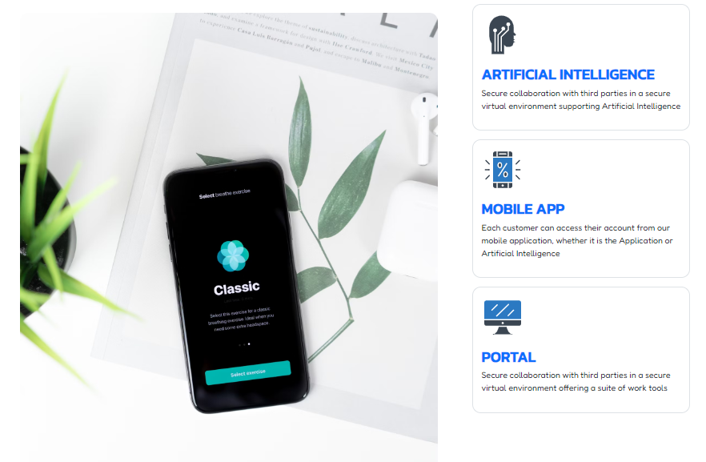

The output intro list include with cover image.

## Digital Intro

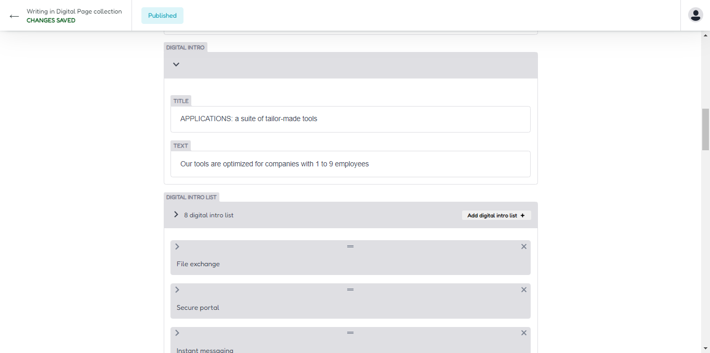

Next you can add digital intro infromation, you can change and update title and text.

## Digital Intro List

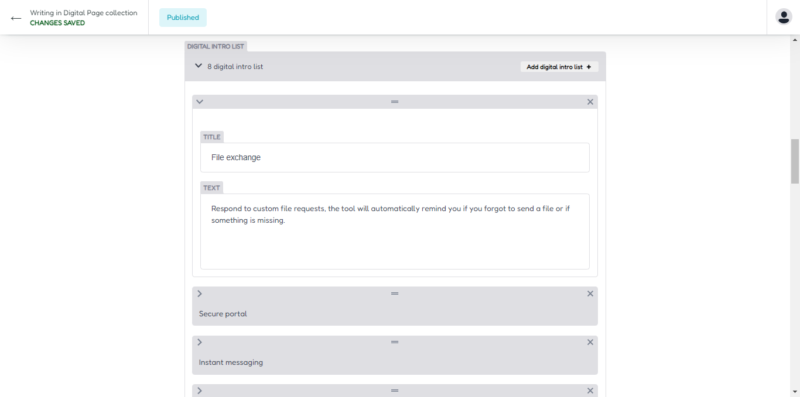

For update digital intro list, you can access on digital intro list area, and update it, for add new you can simply press add new digital intro list button.

### Digital Intro Output

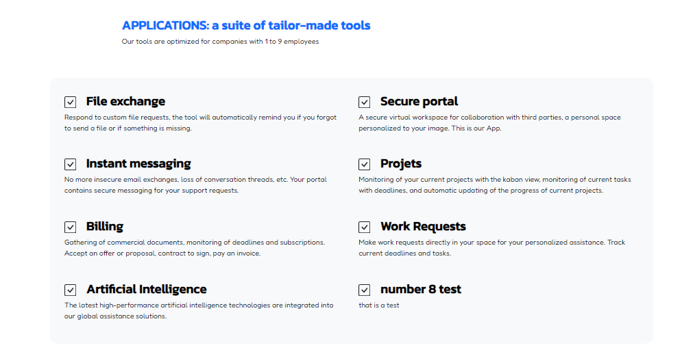

The output digital intro section.

## Workflow Intro

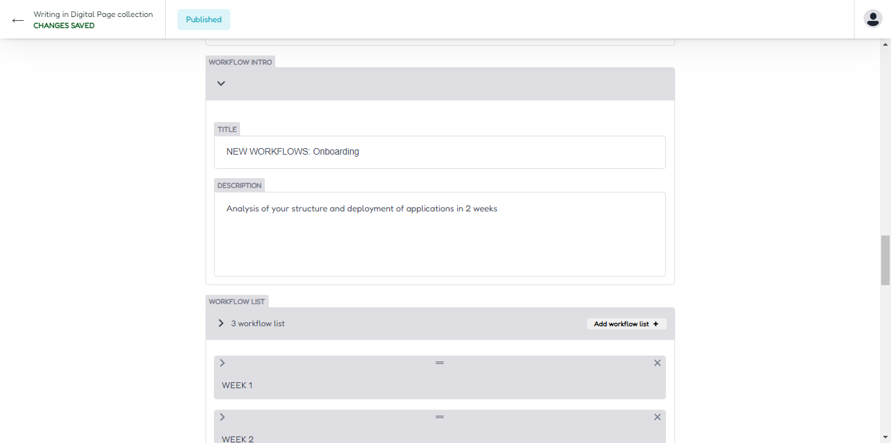

Now you can update your workflow section area,access on workflow intro, and update title and text here.

## Workflow List

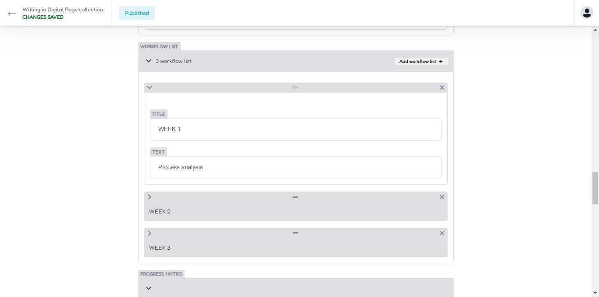

Access on workflow list, and you can add new by click on add new workflow list button, or update your workflow list. insert title and text information for your workflow list.

## Progress Info

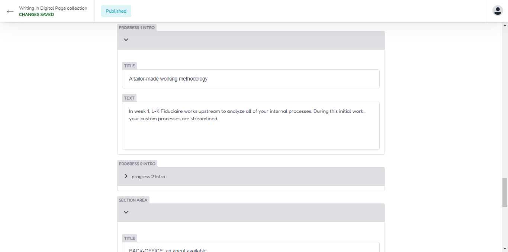

Access on progress info, and update your progress 1 and progress 2 information.

## Section Info

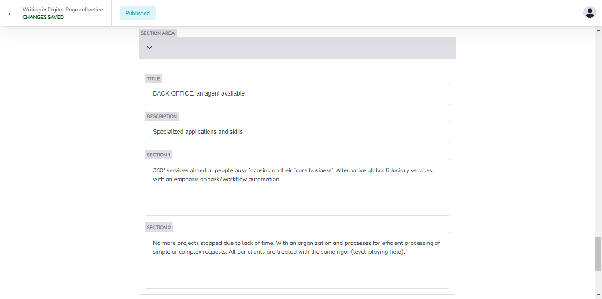

For update section info you can access on section area , and update section area.

## Output Workflow Section

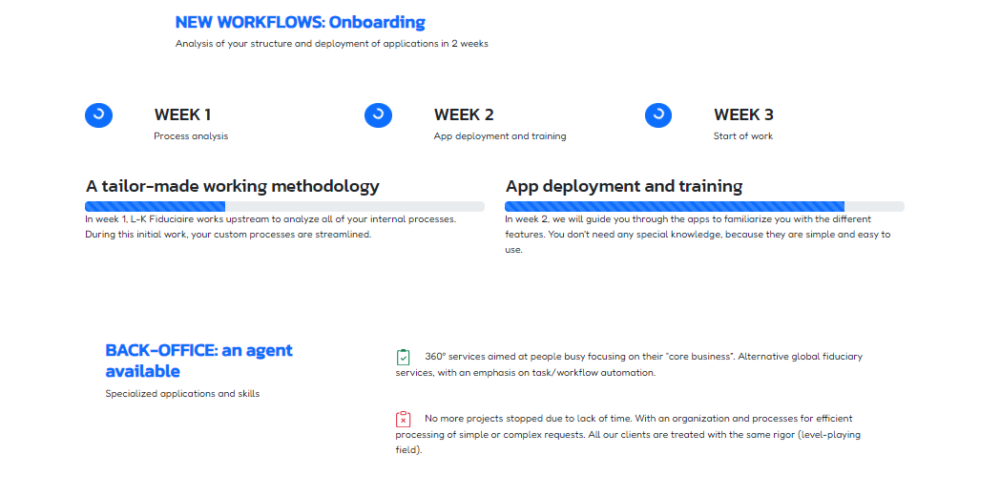

Your Workflow Progress and Section area output look like image.

## Output Digital Page

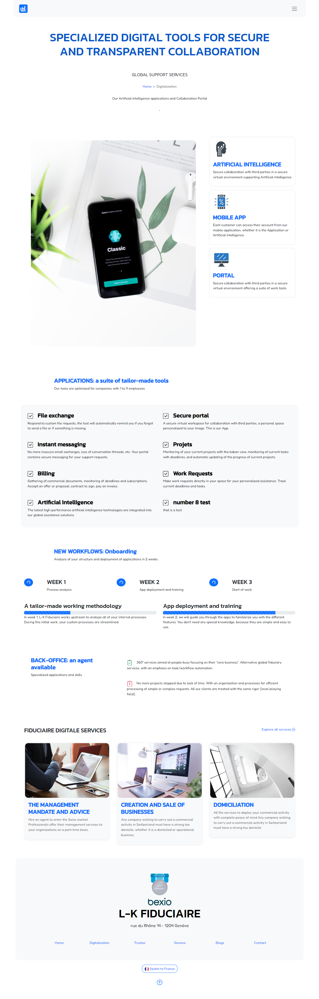

Complete output design for digital area.
