## Domicialiton Area

To update your Domicialiton page select where you want to update your Domicialiton page, for the main site with the English version so you can access on the Domicialiton page, for french or local language you can use the Domicialiton france.

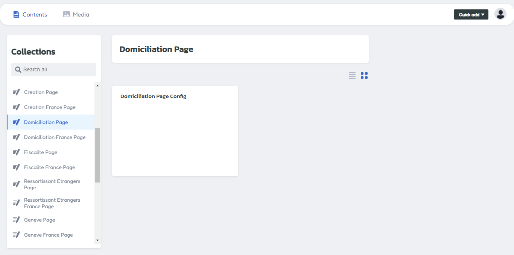

Access on Domicialiton menu, and click on configuration domicialiton setup.

## Header Area

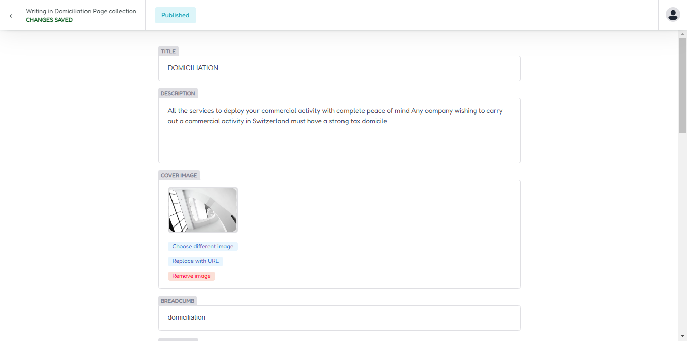

Insert title, description and upload cover image for update your header area.

### Header Output

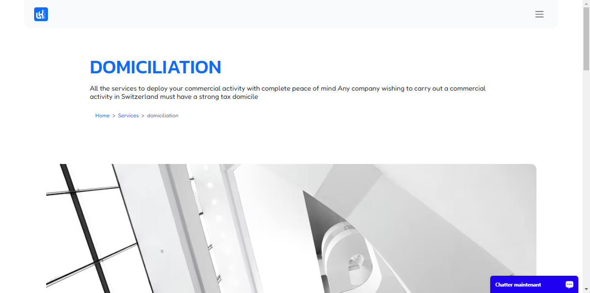

The header area display

## Intro Area

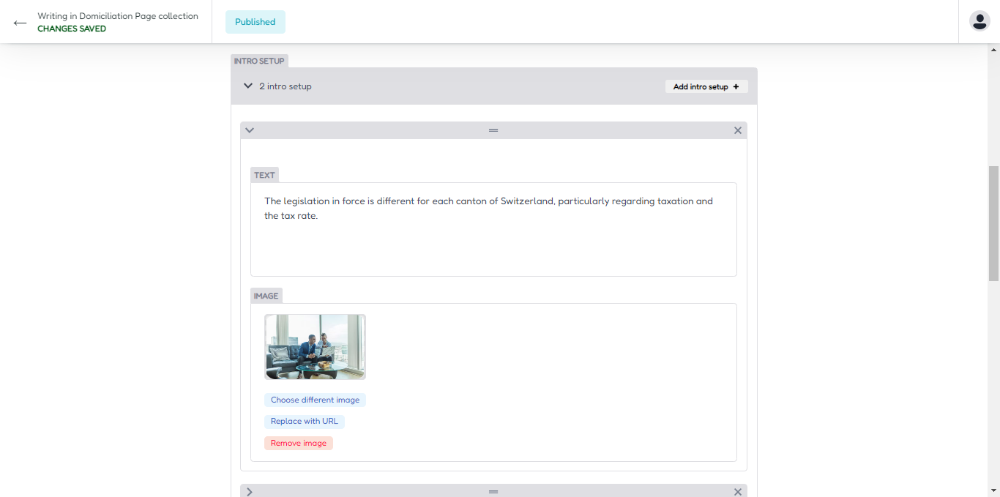

For update intro area , you can access on intro section menu,Next you can insert title, information and upload image for intro section area.

### Intro 1 Output

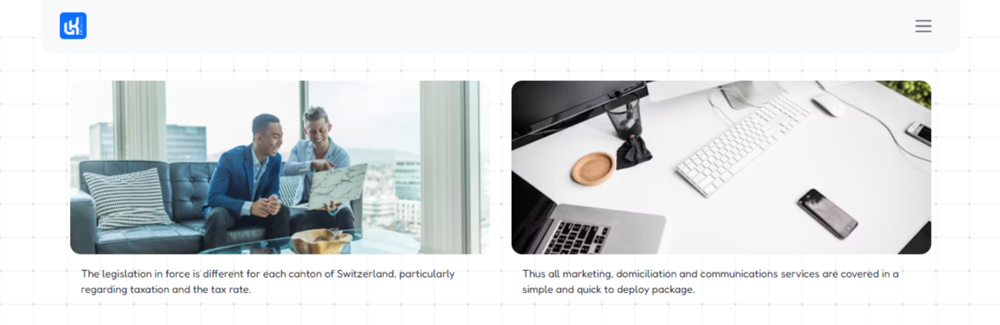

The intro 1 display

## Section Area

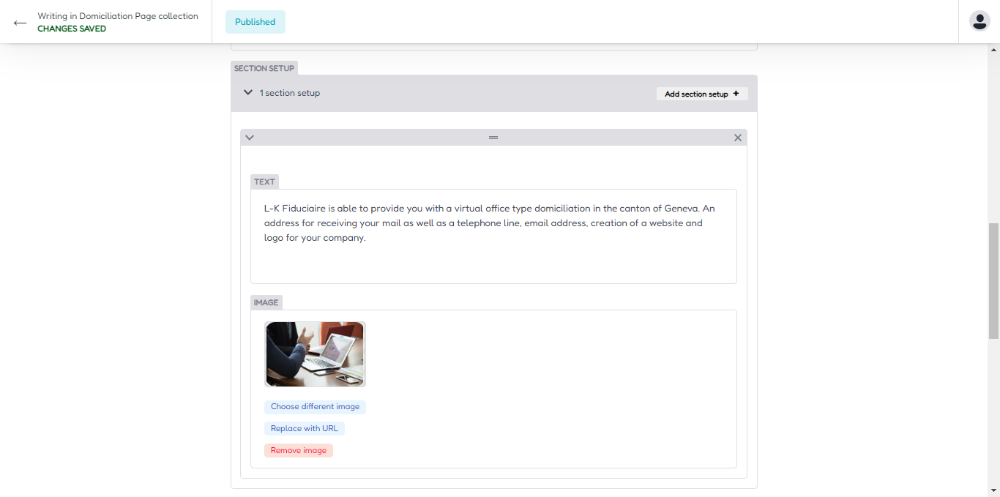

To update section 2 you can access on section 2 area and insert title, text information ,upload your cover image there.

### Section Output

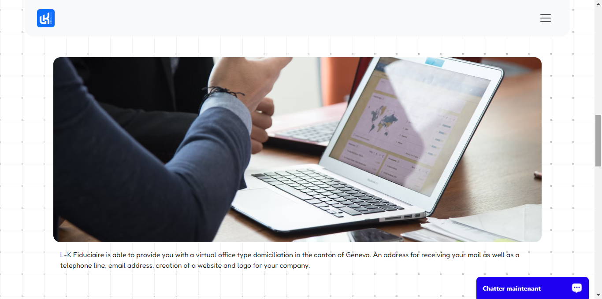

The section display

## List Area

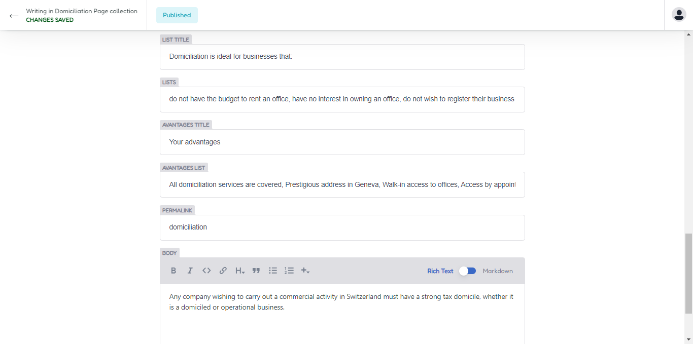

To update list area you can access on list menu, then update it, for create new you can click add new list button.

You can write article content too, on this area.

### List Output

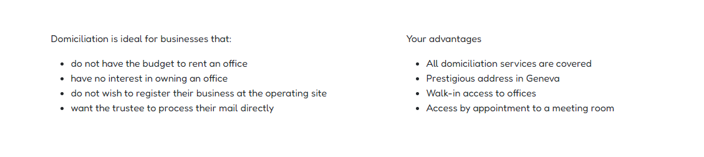

The List area display

### Content Output

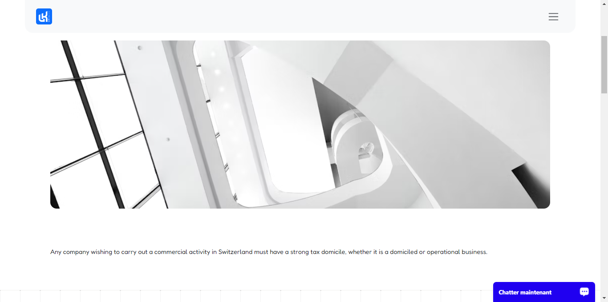

The Content area display

## Full Domicialation Design

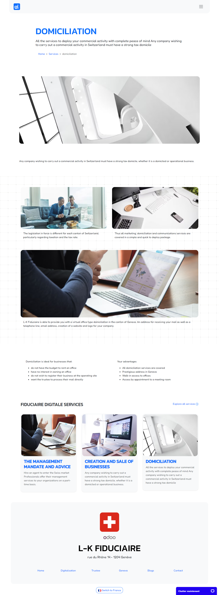
