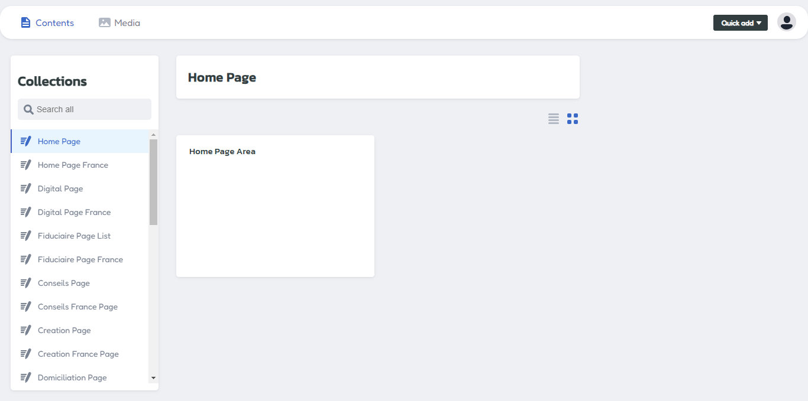
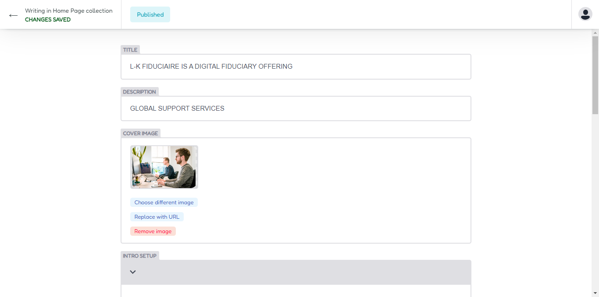
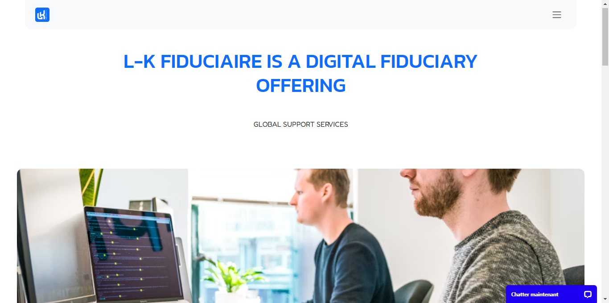
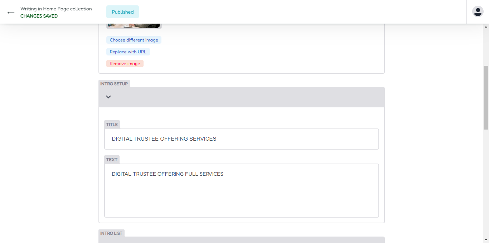
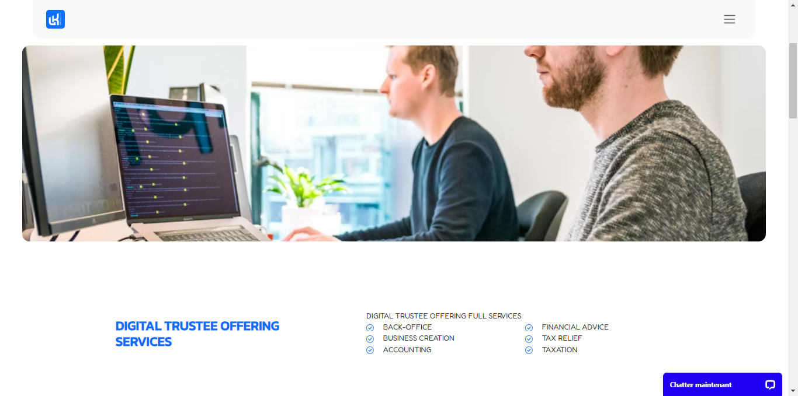
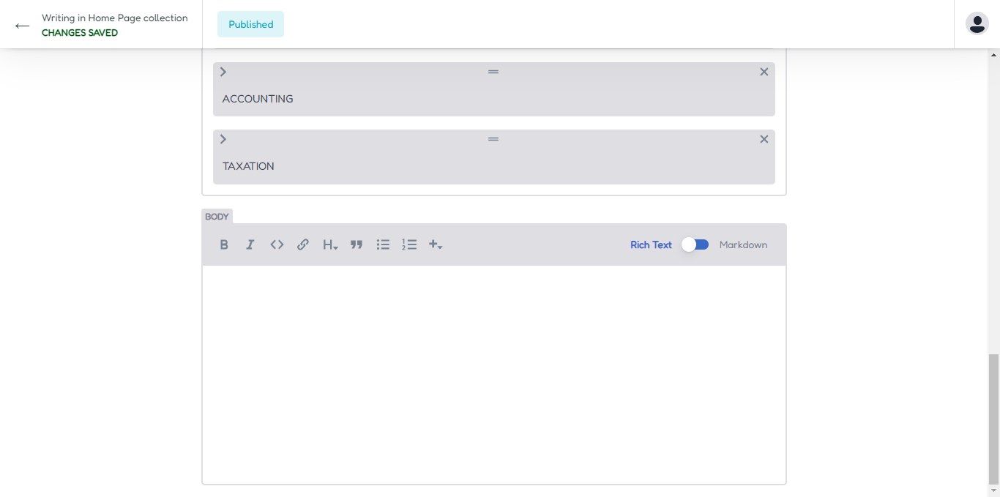
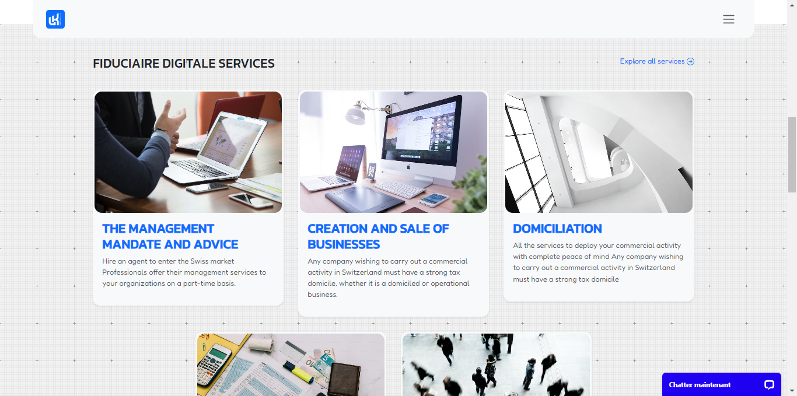
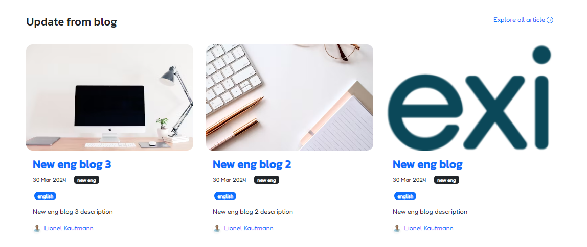
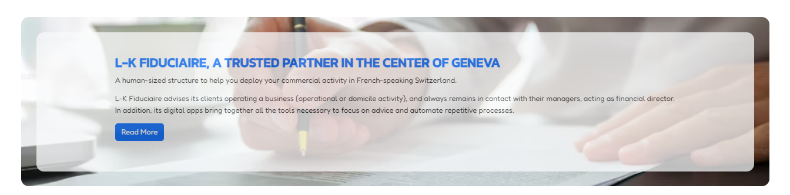
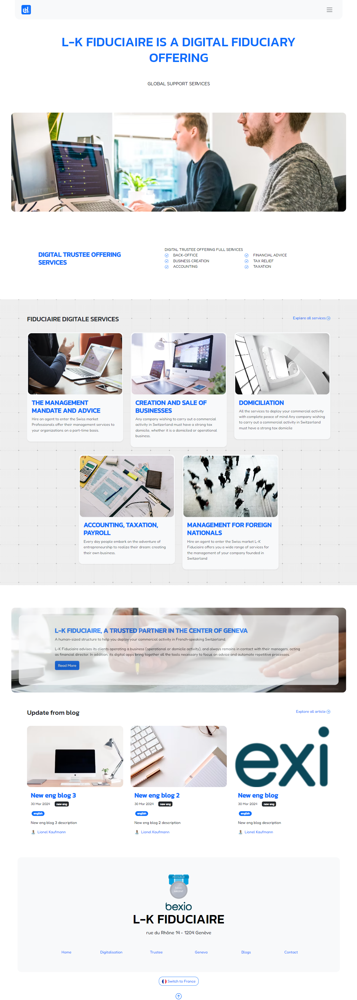

## Home Page Area

To update your home page select where you want to update your home page, for the main site with the English version so you can access on the home page, for french or local language you can use the french home page.

## Header Area

Now you can access on header area for configure your home page header section

Insert your title , description and upload your image cover for home page

### Output Header

Your title, description and image cover will be show on header section area.

## Intro Area

Now you can update your intro area, insert title and text for your intro area.

### Intro List

For update intro list you can access on intro list and update list text here, for add new you can simply click on add new intro list button.

### Output Intro

Your intro title, text and list will be displayed in the intro area

## Content Area

If you want to write article for home page area, you can write content article on this menu.

## Services widget

If you want change services widget , you need to access on setup menu - services widget.

## Blog widget

If you want change blog widget , you need to access on setup menu - blog widget.

## Contact widget

If you want change contact intro widget , you need to access on setup menu - intro.

## Home Page Design

If you want change contact intro widget , you need to access on setup menu - intro.
