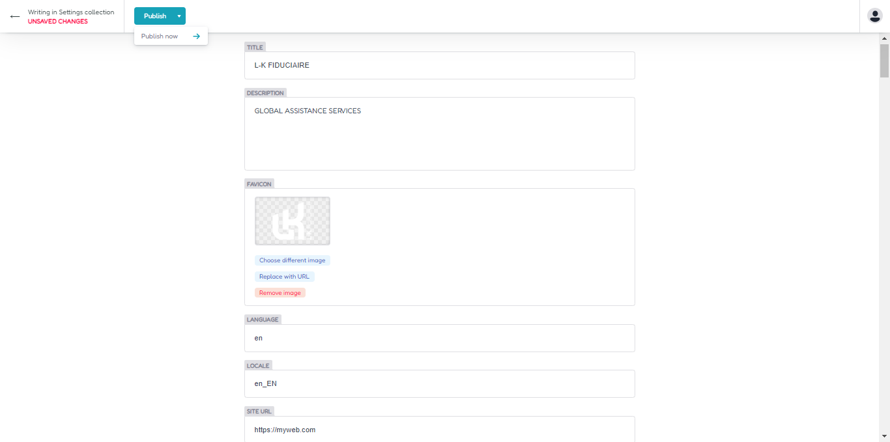
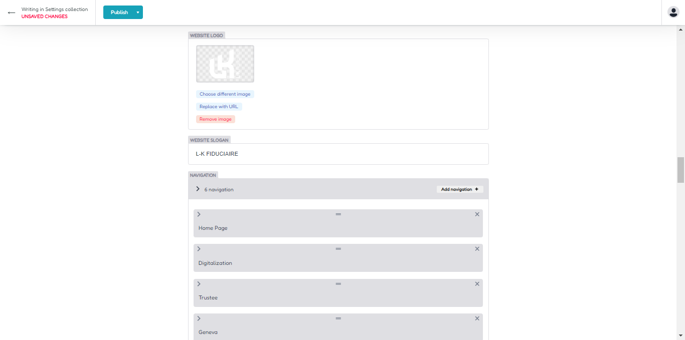
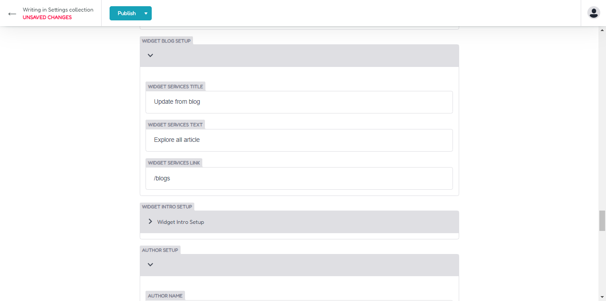

## Configuration

For first we need to setup and configure your site, login in to headless CMS dashboard. and access on settings menu. For main version
 or english you can select settings menu,for france or your local lang you can access on settings france.

Next you can click on site setup for configure your site.

## SEO Setup

Now you can configure your title and description , icon logo and language for your main site.

## Company Setup

Scroll on company profile and insert your company id detail here, this menu for configure your Google JSON LD.

## Map Geo Location Setup

On map menu you can insert detail about your company location, this setup for location google LD JSON.

## Breadcumb Google

Next you can insert your breadcumb menu for configure your google JSON LD breadcumb.

## Google JSON Address

Now you can input your address detail, longitude and latitude map for google address location map.

## Navbar Menu

For update header navigation bar, you can access on navigaation area.
Upload your logo ,insert slogan , and add your navigation map, for create new menu you can click add nav menu.

For nav menu , you can change new icon, insert title nav and input URL link for your navigation menu.

## Social Media Menu

Scroll on social media menu, and insert your twitter URL , facebook URL, and twitter user name, this menu for configure your twitter card and open graph.

## Services Widget

Now you can setup your widget services menu, insert title, description , button , URL Link , and others.

This widget will be shown on your website page services widget.

### Output on home page

Services list widget on home page area

### Output on others page

Services list widget on others page area

## Blog List Widget

If you want change your title and description for blog page, so you can access on blog widget, change title,description, button , breadcumb, and url link for your blog widget. This menu for configure your blog list page , and blog list widget

Output

## Intro Widget

For change title and description and button url link for intro widget , you can access on intro widget area, then insert title,description and others on this area.

Output

## Author Website

You can update your author in author menu, upload your image, insert name and others on this area.

## Footer Setup

For update your footer area , you can access on footer menu, change title, and upload your image on footer area.

### Footer Navigation

If you want change your url link and footer menu nav, you can access on footernav menu, then update with your needed,for add new menu , you can simply click add new footer nav button.

Output

